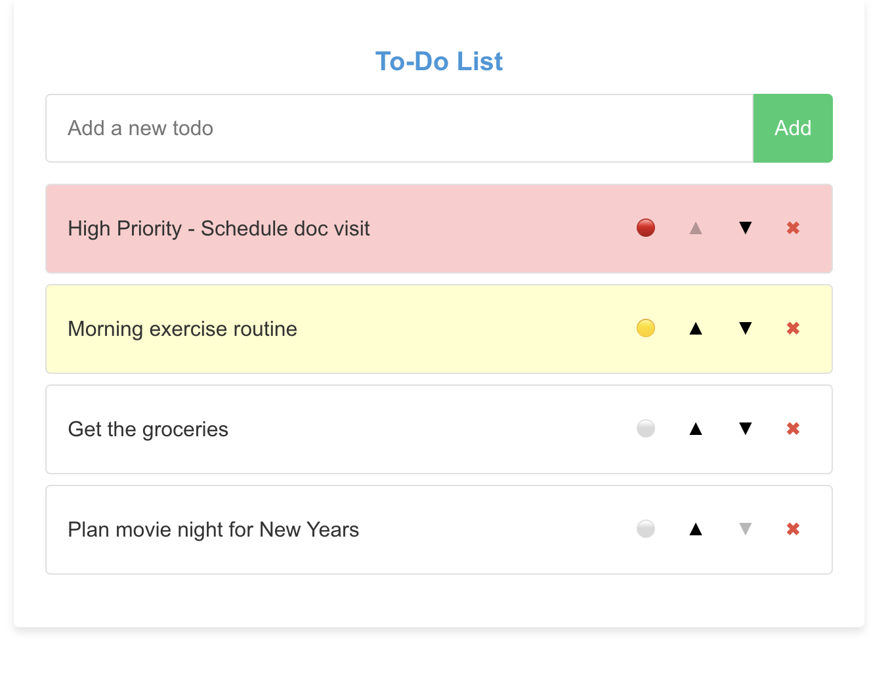
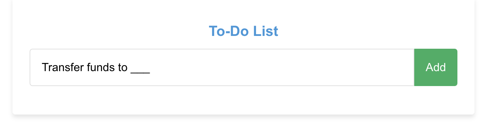
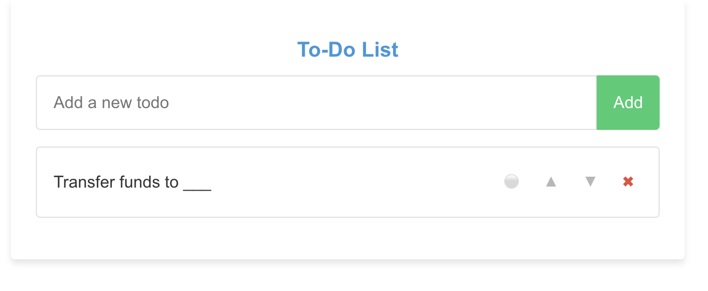
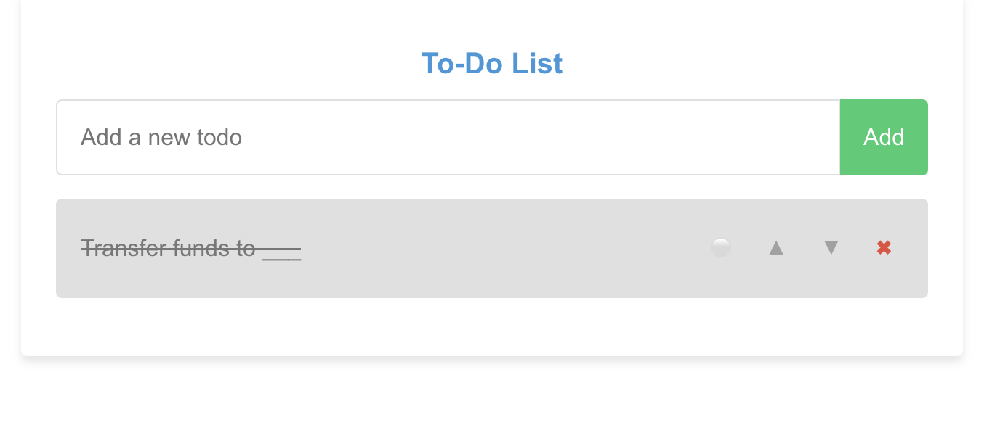
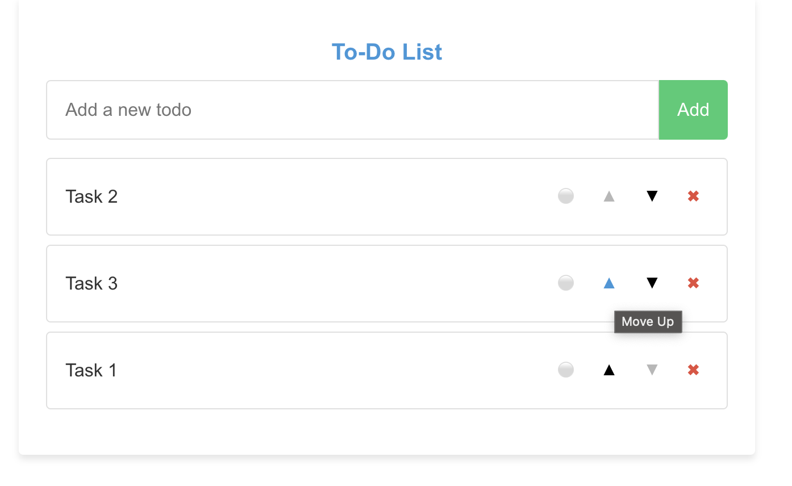

# React TypeScript Todo App

A feature-rich, stylish Todo application built with React and TypeScript. This app allows users to manage their tasks with priorities, reordering, and local storage persistence.

## Features

- Add, edit, and delete tasks
- Mark tasks as complete
- Set priority levels for tasks (Normal, Medium, High)
- Reorder tasks with up/down controls
- Persistent storage using localStorage
- Responsive design with a clean, modern UI

## Screenshots

### Adding a new task

### Completed and prioritized tasks

### Reordering tasks

## Usage

- **Adding a task**: Type your task in the input field at the top and press Enter or click the "Add" button.
- **Completing a task**: Click on the task text to toggle its completion status.
- **Setting priority**: Click the priority icon (circle) next to a task to cycle through priority levels.
- **Reordering tasks**: Use the up and down arrow buttons to move tasks within the list.
- **Deleting a task**: Click the "X" button next to a task to remove it from the list.